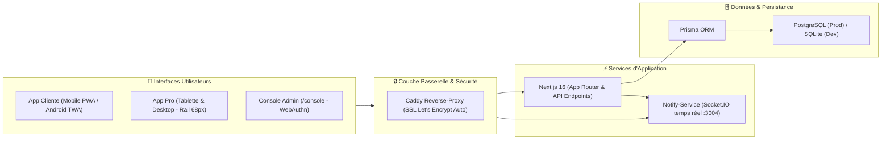

# Product Requirements Document (PRD) — KÈNÈ
**Version :** 2.0 (Mise à jour Septembre 2026)  
**Statut :** Validé & En Production  
**Portée :** Écosystème Global (App Cliente, App Pro Institut, Console Admin, Dermo-Botanique, Infrastructure)

---

## 1. Vision & Positionnement Stratégique

### 1.1 Contexte & Problématique
La dermatologie et la cosmétologie mondiales ont historiquement été formulées, testées et calibrées pour les phototypes caucasiens (Fitzpatrick I à III). Pour les personnes à la **peau mélanoderme (Fitzpatrick IV à VI)** en Afrique subsaharienne et dans la diaspora :
1. **Déficit d'expertise diagnostique adaptée** : La réaction pigmentaire exacerbée (mélanocytes volumineux et hyper-réactifs générant de l'hyperpigmentation post-inflammatoire - HPI) est mal diagnostiquée par les algorithmes de vision par ordinateur génériques.
2. **Le fléau de la dépigmentation volontaire (Khessal, Tchatcho)** : L'utilisation de corticoïdes puissants et d'hydroquinone provoque des dégâts dermatologiques irréversibles (ochronose, atrophie, vergetures nécrotiques).
3. **Absence de digitalisation intégrée des instituts de beauté africains** : La majorité des salons fonctionnent sans logiciel de caisse certifié, sans traçabilité des diagnostics, sans agenda synchronisé ni gestion sociale conforme (CNPS, SYSCOHADA, Mobile Money).

### 1.2 La Mission Kènè
> *Kènè (« la peau, la santé, le corps » en moré)* a pour vocation de devenir **la plateforme dermo-esthétique panafricaine de référence** :
> 1. **Démocratiser le diagnostic de précision** grâce à une IA vision calibrée pour les carnations foncées.
> 2. **Sublimer la pharmacopée dermo-botanique africaine** en mariant ingrédients ancestraux purs et actifs cliniques modernes.
> 3. **Fournir un système d'exploitation complet (OS Pro)** aux instituts de beauté d'Afrique de l'Ouest et centrale (caisse POS SYSCOHADA, agenda multi-cabines, paie CNPS/IPRES, CRM 360°).

---

## 2. Personas Cibles

| Persona | Profil & Rôle | Besoins Clés | Solution Kènè |
| :--- | :--- | :--- | :--- |
| **Mariam (28 ans)** *Cliente finale* | Abidjan / Dakar, cadre active, peau mixte sujette aux taches d'acné (HPI). | Comprendre sa peau sans jargon, trouver des rituels botaniques sains sans hydroquinone, réserver dans des instituts fiables. | Scan IA 3D en 23 zones, jumeau numérique, ordonnance dermo-botanique avec Pass Cabine QR, boutique d'actifs locaux avec cashback wallet. |
| **Fatou Koné (42 ans)** *Gérante d'institut* | Fondatrice de *Cabinet LA DERMO*, équipe de 6 esthéticiennes et dermo-conseillères. | Fini les carnets papier : gérer les rendez-vous, encaisser en Wave / Orange Money, payer le personnel aux normes CNPS, fidéliser la clientèle. | Kènè Pro complet : Caisse POS avec tickets thermiques 80 mm, Agenda multi-praticiennes, fiches CRM 360° avec photos réelles, paie et comptabilité automatique SYSCOHADA. |
| **Awa (24 ans)** *Dermo-conseillère en cabine* | Praticienne diplômée en soins cutanés au sein d'un institut partenaire. | Réaliser des bilans de peau structurés lors des consultations, imprimer des fiches de consentement adaptées à tous les publics. | Module « Diagnostic en cabine » (questionnaire 21 questions + caméra VLM), génération de fiches de consultation papier PDF (avec empreinte digitale ou signature). |
| **Direction Kènè** *Administrateur Réseau* | Équipe centrale de pilotage et de régulation de la plateforme. | Superviser les instituts affiliés, piloter les commissions, sécuriser les accès et gérer les abonnements Kènè+. | Console d'administration durcie (`/console`), authentification WebAuthn Passkeys, step-up MFA, audit trail certifié. |

---

## 3. Périmètre Fonctionnel Détaillé

### 3.1 Espace Cliente (Web Responsive & Android TWA)
* **Le Seuil & Découverte** :
  - Page d'accueil cinématique sans friction avec hero éditorial.
  - Stories vidéo opt-in « Découvrir Kènè en 30 secondes ».
  - Reconnexion express 1-tap basée sur le stockage sécurisé de compte.
  - Mode exploration libre sans inscription obligatoire.
* **Moteur d'Analyse Cutanée (Diagnostic IA VLM)** :
  - Cartographie anatomique en **23 zones corporelles** avec buste 3D interactif.
  - Détection et notation sur 100 de 14 indicateurs cutanés (barrière lipidique, HPI, sébum, rougeurs, desquamation).
  - Génération d'une **Ordonnance Dermo-Botanique vectorielle native (PDF)** intégrant le **Pass Cabine QR** pour l'institut.
* **Conseil Virtuel « Dr. Kènè »** :
  - Assistant conversationnel dermo-esthétique alimenté par LLM calibré.
  - Triage médical d'urgence en 3 niveaux :
    - 🟢 *Vert* : Routine dermo-botanique maison.
    - 🟡 *Jaune* : Consultation requise auprès d'une dermo-conseillère en institut.
    - 🔴 *Rouge* : Alerte immédiate (signes ABCDE, suspicion de mélanome, brûlure, ochronose) et orientation d'urgence vers un médecin dermatologue.
  - Entrée vocale (ASR) et synthèse vocale (TTS) avec résumé multilingue (Français, Dioula, Baoulé, Bété).
* **Marketplace & Réservations** :
  - Prise de rendez-vous en ligne avec calcul d'acompte anti-no-show.
  - Boutique dermo-botanique organisée par institut partenaire.
  - Paiement intégré Mobile Money (Wave, Orange Money, MTN) et Wallet Kènè avec cashback automatique de 5 %.

### 3.2 Espace Pro (Gestion Complète d'Institut — Kènè Pro)
* **Design & Navigation Optimisée (Option 1 - Septembre 2026)** :
  - **Bandeau supérieur continu pleine largeur** :
    - Ancrage permanent du **Logo Médaillon officiel (42 px)**, de la marque **« Kènè Pro »** et du slogan **« BEAUTÉ MÉLANODERME »** tout en haut à gauche sur PC, tablette et mobile.
    - Intégration du sélecteur d'établissement actif (`Cabinet LA DERMO`), de l'indicateur temps réel « Direct », du basculeur de thème et du profil gérante.
  - **Rail de navigation gauche compact (68 px)** :
    - Gain de **plus de 170 pixels d'espace utile** pour les tableaux, graphiques et agendas.
    - Icônes centrées avec infobulles descriptives et pastilles d'alertes notifications.
    - Bouton bascule de pliage/dépliage vers 220 px à la discrétion de l'utilisatrice.
* **Agenda Multi-Praticiennes & Cabines** :
  - Grille hebdomadaire et quotidienne par créneaux de 30 minutes.
  - Relances automatiques des clientes par WhatsApp (`wa.me`) pré-formatées.
* **Caisse POS & Facturation** :
  - Écran de caisse tactile ultra-rapide avec ajout de « Cliente express » sans compte obligatoire.
  - Impression directe de tickets thermiques 80 mm ou A4 certifiés conformes au droit comptable SYSCOHADA.
* **Diagnostic en Cabine & CRM 360°** :
  - Protocole dermatologique en 4 sections et 21 critères (incluant le dépistage bienveillant de la dépigmentation et les contre-indications de grossesse).
  - Fiche de consultation papier imprimable avec recueil de consentement par signature ou empreinte digitale.
  - Respect strict du RGPD/APDP : visibilité des self-scans de la cliente conditionnée à son accord explicite.
* **Gestion du Personnel, Paie & Congés** :
  - Pointage des présences journalières (arrivée / départ).
  - Calcul automatisé de la paie conforme aux barèmes sociaux d'Afrique de l'Ouest (CNPS, IGR, CN en Côte d'Ivoire ; IPM, IPRES au Sénégal).
  - Génération des bulletins de paie A4 et du fichier XML pour la télédéclaration **e-CNPS**.
  - Gestion des congés et absences avec décompte automatique hors dimanches et contrôle des plafonds légaux.
* **Comptabilité SYSCOHADA & Fiscalité** :
  - Journal automatique des opérations (Ventes, Achats, Banque, Paie, Opérations Diverses).
  - Grand livre, Balance générale à 6 classes et Liasse fiscale complète générée en 1 clic (Bilan, Compte de résultat, TVA à reverser).

### 3.3 Espace Admin & Sécurité (`/console`)
* **Durcissement NIST 800-63B-4 & OWASP ASVS V2.7** :
  - Séparation étanche de la vitrine publique et de l'administration.
  - Authentification sans mot de passe via **WebAuthn Passkeys** (Biométrie Face ID / Empreinte ou clés FIDO2) avec repli sécurisé par code OTP 6 chiffres.
  - Durée de session limitée à 8 heures et alertes instantanées de connexion avec géolocalisation IP.
  - **Step-up Authentication** (< 5 min) obligatoire avant tout acte critique (suspension d'un salon, modification du taux de commission, révocation d'accès, octroi de mois offerts).
* **Supervision du Réseau & Monétisation** :
  - Tableaux de bord de surveillance du GMV global, des commissions et de la santé des serveurs.
  - Pilotage des abonnements Kènè+ et Pro selon la norme IFRS 15 (traçabilité comptable immuable, zéro écrasement des périodes).
  - Exports comptables CSV conformes avec encodage UTF-8 BOM.
  - **Purge Légale & Anonymisation de Compte (Auditée)** : Droit à l'oubli administrateur sous step-up biométrique, avec conservation comptable obligatoire des montants et anonymisation des tiers.

### 3.4 Sécurité Bancaire, Conformité 2026 & Droit à l'Oubli
* **Authentification par Code PIN Secret (Style Mobile Banking / Wave)** :
  - Hachage cryptographique SHA-256 avec salage par identifiant utilisateur (`pinHash`).
  - Détection anti-bruteforce : compteur de tentatives erronées (`pinFails`), verrouillage exponentiel (`pinLockedUntil`) après 5 échecs.
  - Clavier tactile sécurisé avec brouillage aléatoire optionnel (`PinKeypad.tsx`).
* **Conformité Suppression de Compte 2026 (Normes Apple, Google, ARTCI & SYSCOHADA)** :
  - **Self-Service In-App (Apple App Store 5.1.1(v) & Google Play)** : Déclenchement direct depuis l'application cliente (`SettingsScreen.tsx`), confirmation par code PIN secret.
  - **Purge Totale des Données de Santé & Intimité** : Suppression physique irréversible des photographies cutanées, bilans IA VLM, conversations Dr. Kènè, diagnostics, passeports de peau, passkeys et consentements.
  - **Préservation Fiscale & Comptable (Article 24 Acte Uniforme SYSCOHADA - Obligation 10 ans)** : Pour préserver l'équilibre comptable des instituts partenaires, les lignes de facturation et montants sont conservés, mais les coordonnées personnelles sont expurgées (téléphone randomisé `+22500...`, nom anonymisé `Compte supprimé`, adresse effacée).
  - **Détachement CRM Institut Pro** : Possibilité pour une gérante d'archiver ou détacher un client de son fichier sans supprimer le compte global de l'utilisatrice.
* **Résilience & Idempotence Fintech (Wave, Orange Money, WiniPayer)** :
  - Table d'idempotence `WebhookEvent` : vérification stricte avant encaissement pour empêcher tout double débit ou sur-crédit lors des relances réseaux d'opérateurs.

---

## 4. Spécifications Dermo-Botaniques & Éthiques

### 4.1 La Pharmacopée Officielle Kènè
L'ensemble des recommandations de la plateforme s'appuie sur la sélection rigoureuse de la flore ouest-africaine :
1. **Karité (*Vitellaria paradoxa*)** : Restauration de la barrière lipidique et prévention de la perte insensible en eau (PIE).
2. **Baobab (*Adansonia digitata*)** : Hydratation non comédogène par acides gras insaturés (Oméga 3, 6, 9).
3. **Moringa (*Moringa oleifera*)** : Détoxification et éclat cellulaire grâce à 46 antioxydants naturels.
4. **Bissap (*Hibiscus sabdariffa*)** : Unification du teint et exfoliation douce par AHA naturels sans rebond pigmentaire.
5. **Aloès / Aloka (*Aloe vera*)** : Apaisement immédiat de l'inflammation et régénération post-solaire ou rasage.
6. **Neem (*Azadirachta indica*)** : Action purifiante antibactérienne contre l'acné active et les folliculites.
7. **Néré (*Parkia biglobosa*)** : Reminéralisation et tonicité des tissus cutanés éprouvés par l'Harmattan.
8. **Banane Plantain (*Musa paradisiaca*)** : Cataplasmes anti-inflammatoires et amidons adoucissants.
9. **Actifs complémentaires** : Kinkeliba (détox pollution), Tamanu (marques anciennes), Dattier du désert (peaux grasses), Souchet (anti-repousse poils), Ricin noir (edges et tempes), Cacao (élasticité et potasse de cendre pour le véritable Savon Noir).

### 4.2 Les Lignes Rouges Médicales & Déontologiques
* **Refus catégorique de tout actif dépigmentant** : Zéro hydroquinone, zéro dermocorticoïde, zéro sel de mercure.
* **Frontière stricte cosmétique vs dermatologie** : Kènè ne prétend pas soigner les cancers de la peau (mélanomes acraux), les infections bactériennes profondes, les dermatoses auto-immunes (lupus, vitiligo) ou l'ochronose exogène. En présence de telles anomalies, le système applique un protocole d'arrêt immédiat et réoriente vers un médecin dermatologue.

---

## 5. Architecture Technique & Performance

* **Frontend** : Next.js 16 (React 19), Tailwind CSS 4, shadcn/ui, Framer Motion, Three.js (@react-three/fiber).
* **Backend & API** : 89 routes d'API modulaires, validation Zod, sessions chiffrées HMAC-SHA256 (Iron-Session pattern).
* **Temps Réel** : `notify-service` dédié (Node.js, Socket.IO, port 3004), heartbeat anti-zombie, synchronisation instantanée des notifications, ventes et rendez-vous sans rechargement.
* **Moteur PDF Autonome** : `src/lib/accounting/pdf.ts` (moteur PDF vectoriel natif zéro-dépendance externe pour liasse comptable, bulletins de paie, ordonnances et Pass Cabine).
* **Base de Données** :
  - Schéma Prisma unifié de 30 tables avec support multi-tenant natif (`tenantId`).
  - Schéma de développement : `prisma/schema.prisma` (SQLite).
  - Schéma de production : `prisma/schema.postgresql.prisma` (PostgreSQL).
  - Script d'export/import d'intégrité : `scripts/migrate-sqlite-to-postgres.ts`.

---

## 6. Critères d'Acceptation & Qualité (DoD)

1. **Qualité de code & typage** : `npx tsc --noEmit` validé avec **0 erreur** sur l'ensemble du dépôt.
2. **Accessibilité & Contrastes** : Ratios de contraste WCAG AA validés sur les thèmes clair et sombre pour l'ensemble des palettes panafricaines (`#C8951E`, `#8B1A3B`, `#A0522D`, `#F8F1E4`).
3. **Visibilité permanente de la marque** : Logo Médaillon, Nom et Slogan lisibles en haut à gauche sur tous les modes (Desktop, Tablette, Mobile) sans débordement ni troncature.
4. **Disponibilité des services** : Next.js (:3000) et notify-service (:3004) surveillés avec redémarrage automatique en conteneur Docker.
